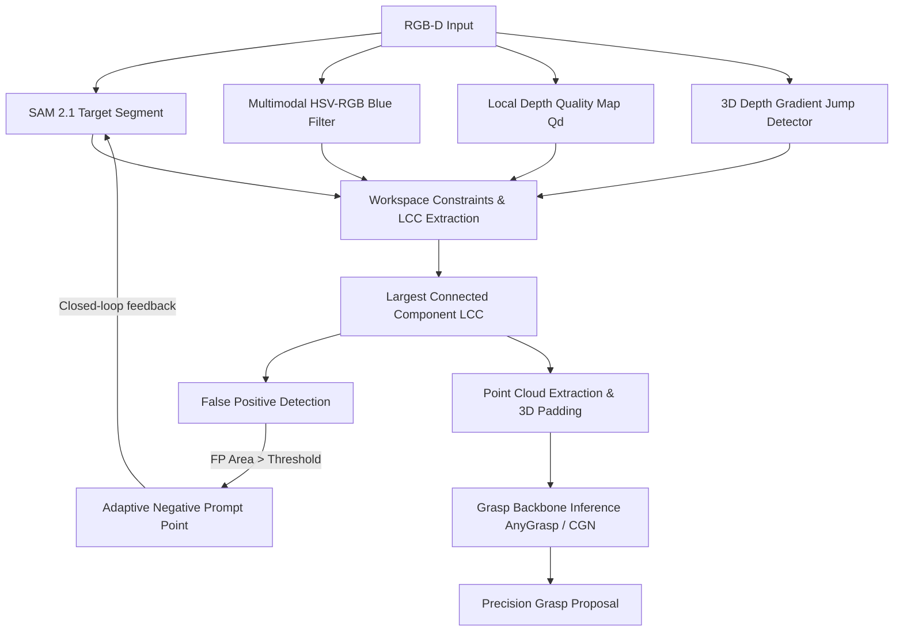

# Section 3: Methodology

In this section, we present the mathematical formulation and systemic design of the proposed target-region preprocessing pipeline. The framework is designed to bridge 2D semantic segmentation and 3D geometric grasp detection by enforcing physical boundaries and color-depth multimodal constraints.

---

## 3.1 Multimodal Workspace and Container Filtering
In industrial and sorting environments, target garments are frequently placed inside standard storage containers, such as blue plastic bins. Reflections and specular boundary alignment can easily cause 2D segmentation models to leak into these structures. We define a multimodal color filter in the RGB space to isolate such container geometry:
$$M_{blue}(p) = \mathbb{I}\left(B(p) > 1.15 \cdot R(p) \land G(p) > 1.05 \cdot R(p) \land B(p) > 50\right)$$
where $p = (u,v)$ represents the pixel coordinate, and $B(p)$, $G(p)$, $R(p)$ represent the blue, green, and red channel intensities, respectively. $\mathbb{I}(\cdot)$ is the indicator function. The resulting mask $M_{blue}$ isolates the container region, designating it as background workspace.

---

## 3.2 Local Depth Quality Map ($Q_d$) Estimation
Transparent and specular materials cause severe infrared reflection loss, resulting in depth measurement voids and high-frequency edge noise. To evaluate depth reliability, we compute a local standard deviation map over a sliding window $\mathcal{W}(p)$ of size $W \times W$ (default $5 \times 5$):
$$\sigma_d(p) = \sqrt{\frac{1}{|\mathcal{W}(p)|} \sum_{p_i \in \mathcal{W}(p)} (d(p_i) - \mu_d(p))^2}$$
where $\mu_d(p)$ is the local mean depth, and $d(p)$ is the raw depth value. Let $\sigma_{95}$ represent the 95th percentile of all valid standard deviations in the frame. The normalized depth quality score $q_d(p)$ is formulated as:
$$q_d(p) = \begin{cases} 
1.0 - \min\left(\frac{\sigma_d(p)}{\sigma_{95}}, 1.0\right) & \text{if } d(p) > 0 \\
0.0 & \text{if } d(p) = 0 
\end{cases}$$
The quality map $Q_d$ serves as a soft spatial weight, highlighting regions of reliable geometric surfaces.

---

## 3.3 3D Spatial Discontinuity and Boundary Jump Detection
To prevent the target mask from leaking across physical boundaries, we detect spatial depth discontinuities by computing the depth gradient magnitude:
$$\nabla d(p) = \sqrt{\left(\frac{\partial d(p)}{\partial x}\right)^2 + \left(\frac{\partial d(p)}{\partial y}\right)^2}$$
where the partial derivatives are estimated using Sobel operators. We define the physical discontinuity mask $M_{jump}(p)$ as:
$$M_{jump}(p) = \mathbb{I}\left(\nabla d(p) > \tau_{jump} \lor d(p) == 0\right)$$
where $\tau_{jump}$ is a gradient magnitude threshold (default 15.0 mm). To form a continuous physical barrier, we apply binary dilation:
$$M_{jump\_exp} = M_{jump} \oplus \mathcal{S}_{3\times 3}$$
where $\mathcal{S}_{3\times 3}$ is a $3 \times 3$ square structuring element.

---

## 3.4 Spatially Contiguous Extraction via Largest Connected Component (LCC)
By combining the semantic mask $M_{sam2}$ with the quality map $Q_d$, the container filter $M_{blue}$, and the expanded discontinuity barrier $M_{jump\_exp}$, we extract a clean target region:
$$M_{cand}(p) = M_{sam2}(p) \land (q_d(p) > 0) \land \neg M_{blue}(p) \land \neg M_{jump\_exp}(p)$$
We apply connected component labeling on the binary mask $M_{cand}$:
$$\mathcal{L} = \text{Label}(M_{cand})$$
The Largest Connected Component (LCC) is selected to represent the target object body, removing scattered noise and leaked table or container edges:
$$M_{lcc}(p) = \mathbb{I}\left(\mathcal{L}(p) == \arg\max_{l \ge 1} \sum_{p'} \mathbb{I}(\mathcal{L}(p') == l)\right)$$
Finally, morphological closing is applied to fill interior holes:
$$M_{target} = M_{lcc} \bullet \mathcal{S}_{5\times 5}$$

---

## 3.5 Closed-Loop SAM2 Adaptive Negative Prompting
To correct 2D semantic mask leakage during inference, we implement a feedback loop. We define the global background mask as:
$$M_{bg}(p) = \neg M_{lcc}(p) \lor M_{blue}(p)$$
If the initial SAM 2.1 mask $M_{sam2}^{(1)}$ overlaps with $M_{bg}$, we compute the False Positive (FP) mask:
$$M_{FP}(p) = M_{sam2}^{(1)}(p) \land M_{bg}(p)$$
If the area of the false positive region exceeds a threshold (e.g., 100 pixels), we calculate its centroid:
$$u_{FP} = \frac{\sum_{p} u \cdot M_{FP}(p)}{\sum_{p} M_{FP}(p)}, \quad v_{FP} = \frac{\sum_{p} v \cdot M_{FP}(p)}{\sum_{p} M_{FP}(p)}$$
A negative prompt point (coordinate $(u_{FP}, v_{FP})$ with label $0$) is automatically appended to the SAM 2.1 query list. This triggers a second-stage mask update, contracting the boundaries back to the true target object.

---

## 3.6 Point Cloud Extraction and 3D Boundary Padding
Given the final target mask $M_{target}$ and intrinsic matrix $K$, we back-project the depth map to extract the 3D local region. To prevent cutting off the edges of large or truncated objects (which leads to empty predictions), we apply a 3D padding bounding box. 
Let $P = \{P_i = (x_i, y_i, z_i)\}$ be the filtered point cloud of the target. We compute the bounding limits:
$$x_{min}, x_{max} = \min(P_x) - \delta, \quad \max(P_x) + \delta$$
$$y_{min}, y_{max} = \min(P_y) - \delta, \quad \max(P_y) + \delta$$
$$z_{min}, z_{max} = \min(P_z) - \delta, \quad \max(P_z) + \delta$$
where $\delta = 0.04\text{m}$ (4 cm) is the physical padding. This padded bounding box defines the local workspace cropped from the full scene point cloud, ensuring sufficient boundary point density for the grasp backbones.
